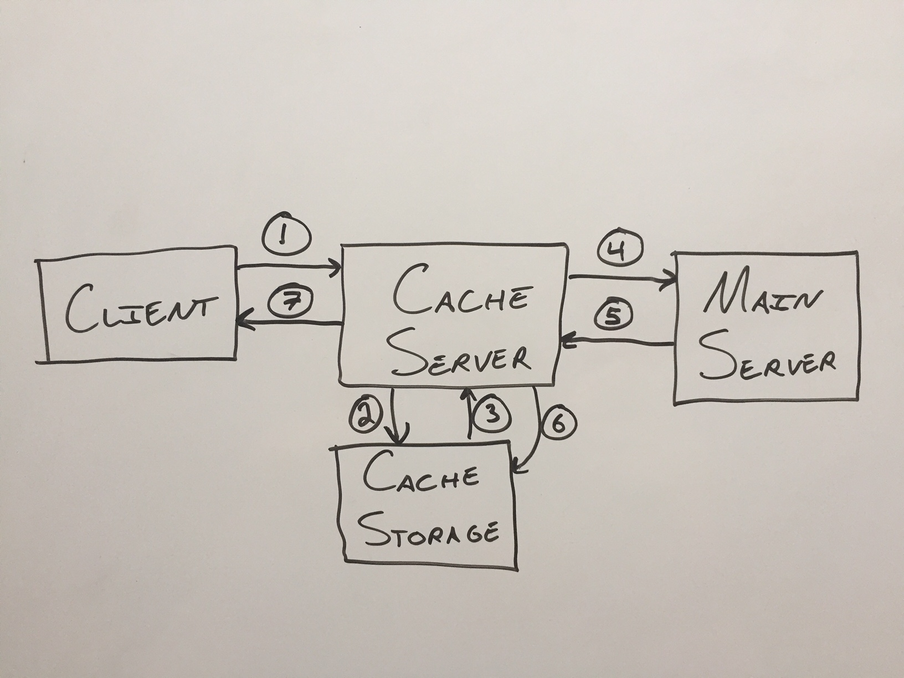
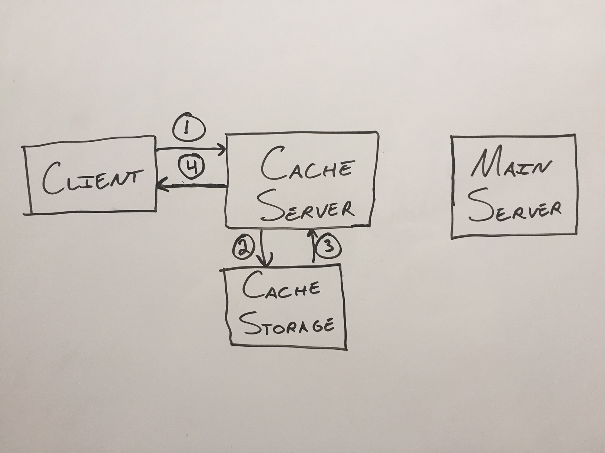
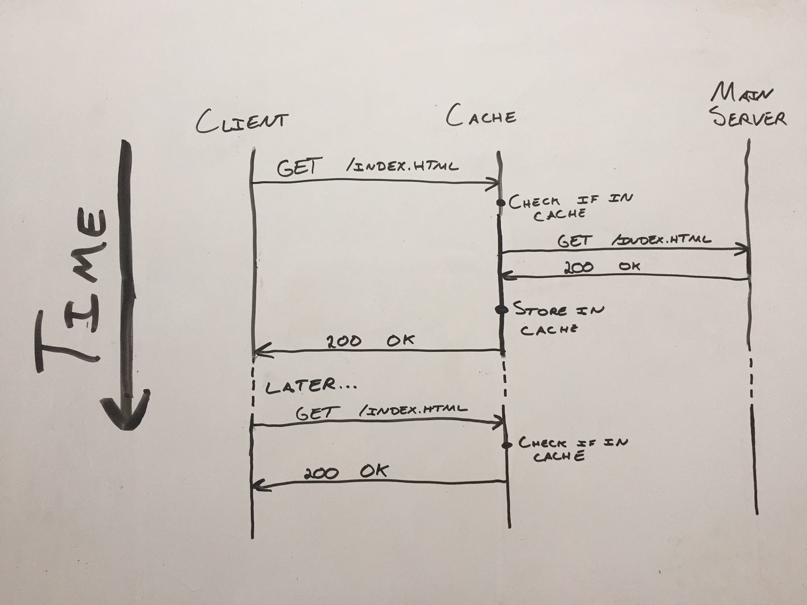
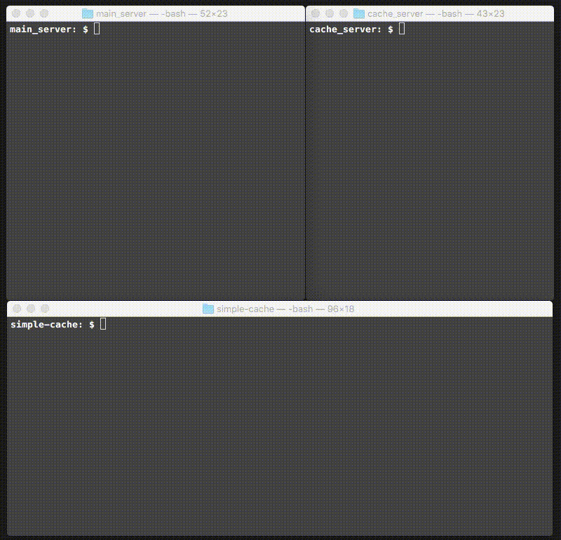

# Simple Cache in Python

## Cache server

This is a simple cache server in python.  I wrote about it [here](https://alexanderellis.github.io/blog/posts/simple-cache-server-in-python/).

Here are the steps for the first time an item is requested:

1. Client requests item
2. Cache server checks if it's stored in the cache
3. The item is not found
4. The cache server requests the item from the main server
5. The main server sends the item back
6. The cache server saves a copy of the item
7. The cache server sends the client the item

We could definitely swap 6 and 7, especially if we're trying to send the item back to the client quickly.

Here's a diagram of a subsequent request for the same item:.

Here are the steps for the future request:

1. Client requests item
2. Cache server checks if it's stored in the cache
3. The item is found
4. The cache server sends the client the item

Although it looks like the main server is lonely to the right, it didn't have to worry about the client's request at all.  Lucky main server!

Here's another way of looking at the problem.  Here, the vertical axis is time increasing as you go down, and the horizontal arrows are the requests back and forth.  The same actions are taken in the same exact order, but the actions are separated vertically by when they happen:

## Usage

First, start the simple http server from the `main_server` directory:
`python httpserver.py 8000`

Then, start the cache proxy server in a separate terminal instance from the `cache_server` directory:
`python cacheproxy.py 8001`

Then, navigate or curl to `localhost:8001`.

Result:

### References
Thanks to joaoventura for the simple http server code!

